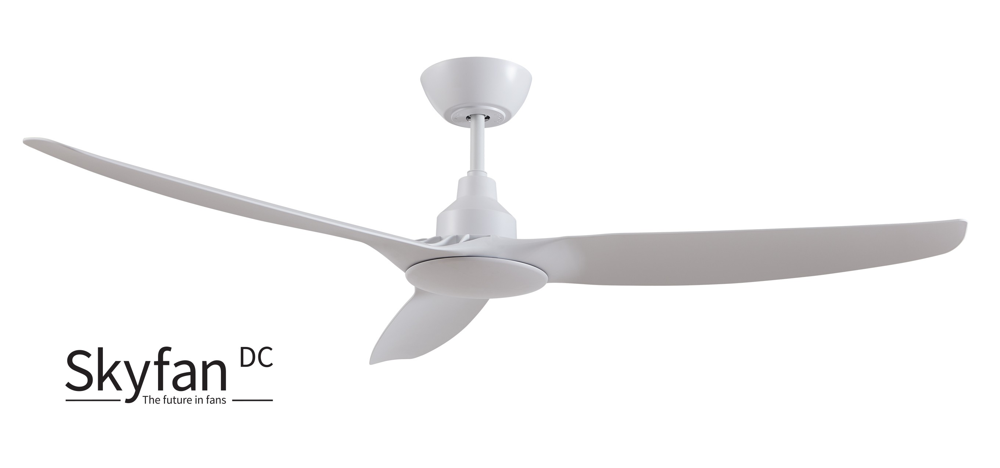

# Ventair Skyfan DC Ceiling Fan

Control your Skyfan DC Ceiling Fan from HomeKit.
- Turn on/off
- Set speed
- Set rotation direction
- Set light on/off
- Set light brightness

## Installation

Go to the Homebridge UI, Plugins screen and search for `homebridge-ventair-ceiling-fan`. Install the plugin and use the form to configure it.

## Configuration

To get your `Id` and `Key` ceiling fan, follow the instructions [Getting your keys](https://github.com/jasonacox/tinytuya/tree/master#setup-wizard---getting-local-keys)

## Thanks

- [tuyapi](https://github.com/codetheweb/tuyapi)
- @marsuboss
# homebridge-ventair-skyfandc
